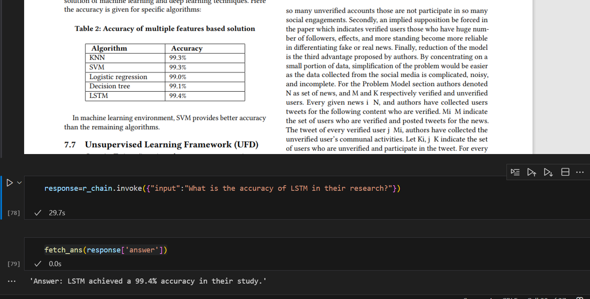

# Optimizing Literature Comprehension with RAG-Enhanced Large Language Models

## Overview

This project is a Retrieval-Augmented Generation (RAG) system designed to extract insights from research papers or any pdf using DeepSeek-R1 (1.5B) as the LLM and Nomic Embed Text for embeddings. It enables question-answering (QA) on academic literature by retrieving relevant document chunks and generating responses using a structured prompt.

## Key Features

- **Retrieval-Based QA**: Answers user queries by retrieving relevant sections from research papers.  
- **Embedding Storage**: Uses FAISS for efficient vector search and fast retrieval.  
- **LLM-Based Response Generation**: Leverages DeepSeek-R1 (1.5B) to generate responses based on retrieved text.  
- **Customizable Text Splitting**: Implements RecursiveCharacterTextSplitter for optimal document chunking.  
- **Modular Design**: Built using LangChain, making it easy to integrate with other models or datasets.  

# Model Efficiency and Performance

Although DeepSeek-R1 (1.5B) has only 1.5 billion parameters, it is highly optimized for instruction-following tasks and precise response generation. By leveraging context-aware retrieval and structured prompting, this model effectively extracts relevant information from research papers and generates meaningful answers, making it an efficient alternative to larger LLMs.

## License

This project is open-source and available under the MIT License.

Built for extracting meaningful insights from academic research using AI! 

